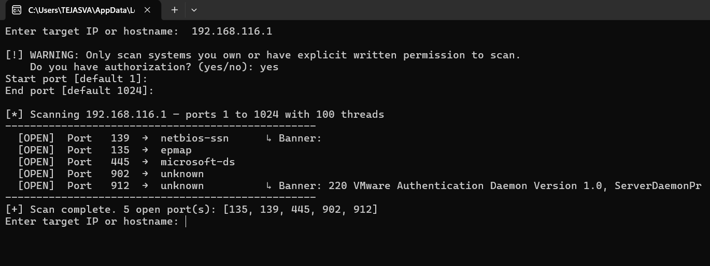

# Python Port Scanner

A Python-based multithreaded port scanner built for learning network security fundamentals.

## Project Versions

Version 1 – Basic Port Scanner  
File: Scanner.py  

A simple Python script that scans ports 1–1024 on a target host using socket connections and threads.

Version 2 – Advanced Port Scanner  
File: scanner2.py  

Enhanced version with:
- Thread pool scanning
- Banner grabbing
- Hostname resolution
- Input validation
- Custom port ranges

## Technologies Used

- Python
- socket
- threading
- queue

## How to Run

1. Clone the repository
2. Run the scanner

## Example Output

